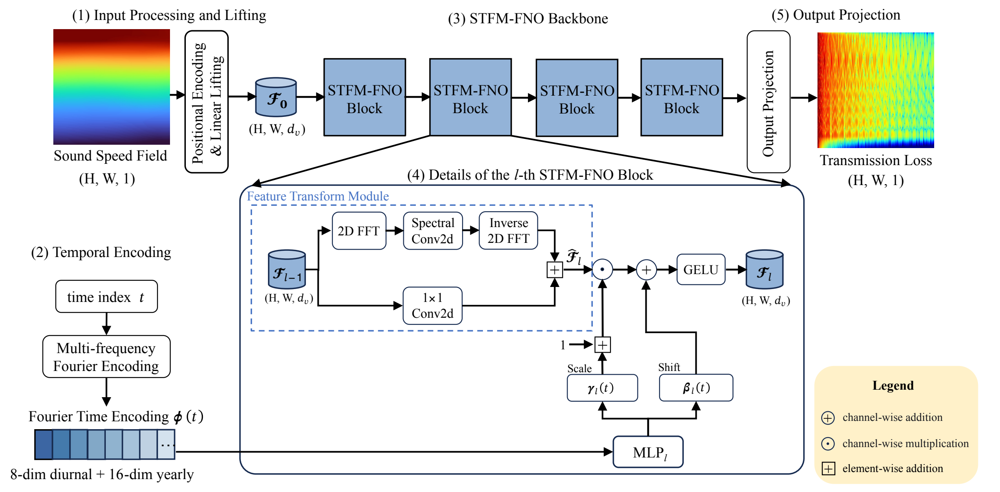
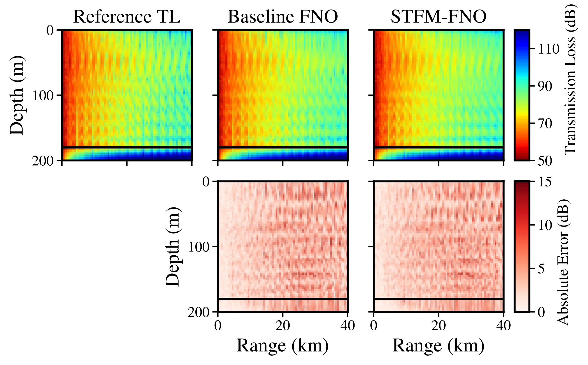
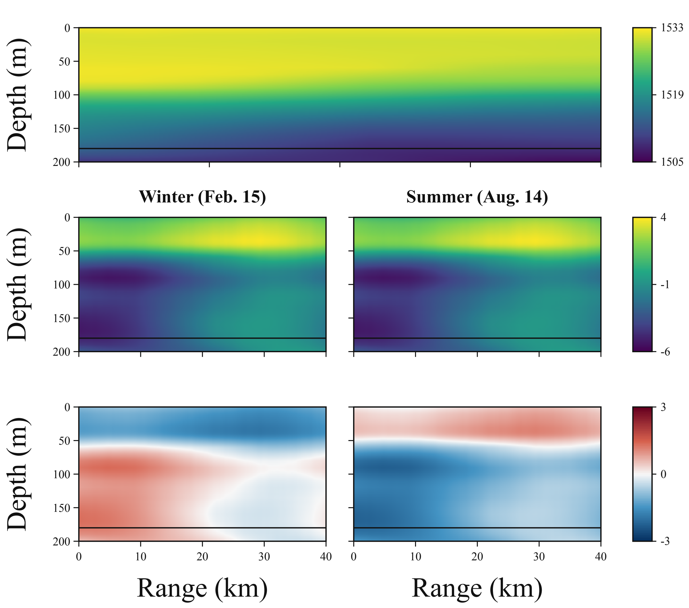

# STFM-FNO for Transmission Loss Estimation

**Spatio-Temporal Field-Modulated Fourier Neural Operator for Transmission Loss Estimation**

Yufei Yang, Yifan Sun, Lei Cheng, and Peter Gerstoft

[Project page](https://yufeila.github.io/TAM-FNO-Underwater-Acoustic-Prediction/) | [Revised manuscript](https://yufeila.github.io/TAM-FNO-Underwater-Acoustic-Prediction/paper.pdf) | [Software citation](CITATION.cff)

STFM-FNO estimates ocean acoustic transmission loss (TL) from a sound speed field (SSF), range-depth coordinates, and the associated time. The output is TL at the **same locations and time**, not a forecast of a future acoustic field.

The repository was originally released as **TAM-FNO**. Its URL, package name, environment name, module names, and command-line entry points retain that name for compatibility.

## September 2026 Manuscript Update

The public manuscript and project page now reflect the revised study:

- Use **TL estimation** consistently and clarify the model's inputs and outputs.
- Treat time as auxiliary conditioning that exploits the dataset's temporal organization, not as an additional physical state variable.
- Explain daily/yearly Fourier encoding and block-wise latent feature modulation.
- Report the monthly blocked evaluation with temporal purge intervals.
- Include conditional FNO baselines, a separately retrained 100-Hz experiment, and alternative temporal encodings.
- Update the architecture, acoustic-field comparison, and feature-interception figures.

These are results from the revised manuscript, not new experiments run for this documentation update.

## Method

The spatial branch lifts the SSF and its coordinates to latent features and processes them through four FNO blocks. The temporal branch maps the associated time index to daily and yearly sine-cosine features. Four daily and eight yearly harmonics yield a 24-dimensional descriptor.

For each block, a temporal MLP generates channel-wise scale and shift parameters. Their affine action on spatially varying latent features produces a time-conditioned modulation field. Spatial convolution parameters remain shared across time; time is not concatenated with the SSF input.

Daily and yearly periods provide physically motivated time scales, sine-cosine pairs preserve phase continuity across cycle boundaries, and multiple harmonics enrich within-cycle variation.



## Revised Evaluation Protocol

The study uses 2,920 SSF snapshots over one year, with eight samples per day. RAM supplies the corresponding TL reference fields.

| Partition | Samples |
| --- | ---: |
| Training | 2,144 |
| Test | 584 |
| Purged from both sets | 192 |

Each month contributes a central continuous test block. One-day intervals on either side are excluded from training and testing to reduce temporal leakage from highly correlated neighboring SSFs. Input and output normalization uses training data only.

The main configuration uses a 200-Hz source, a 50-m source depth, and a 199-by-800 range-depth grid covering 0-40 km and 0-200 m.

### Main Comparison

| Model | RMSE (dB), lower is better | Relative L2, lower is better | SSIM, higher is better | PCC, higher is better |
| --- | ---: | ---: | ---: | ---: |
| Baseline FNO | 4.15 | 0.052 | 0.787 | 0.952 |
| Concat-Scalar | 4.22 | 0.053 | 0.781 | 0.951 |
| Concat-PE | 4.77 | 0.059 | 0.734 | 0.938 |
| FNM | 4.42 | 0.055 | 0.755 | 0.947 |
| Low-rank HyperFNO | 4.14 | 0.052 | 0.787 | 0.952 |
| **STFM-FNO** | **3.95** | **0.049** | **0.800** | **0.956** |

STFM-FNO reduces RMSE by 0.20 dB, approximately 5%, relative to Baseline FNO under this protocol. These values replace the earlier random-split results and should not be compared as if they used the same evaluation split.



### Operating-Frequency Change

| Model retrained on the 100-Hz dataset | RMSE (dB) |
| --- | ---: |
| Baseline FNO | 2.27 |
| STFM-FNO | 2.12 |

Both models are retrained on the 100-Hz dataset using the revised study's data-splitting and training settings. This supports robustness of the method under another operating-frequency configuration, **not zero-shot transfer** of a model trained at 200 Hz.

### Alternative Temporal Encodings

| Encoding | RMSE (dB), averaged over three runs |
| --- | ---: |
| Generic-Fourier-FiLM | 3.96 |
| Learned-frequency-FiLM | 3.91 |
| Daily-and-yearly Fourier encoding (STFM-FNO) | 3.90 |

The alternatives compare generic fixed frequencies, learned frequencies, and prescribed daily/yearly scales while holding the architecture and data-splitting strategy fixed. The three encodings give **comparable performance**; the small differences do not establish statistical superiority.

### Feature Interception

The study inspects features before and after modulation in the first block for the same held-out SSF at winter and summer time indices. This model-level probe shows how the temporal branch modulates latent spatial features without changing the SSF input.



## Code Release and Reproduction Status

This repository contains the core model, preprocessing utilities, training and evaluation entry points, and the project page. It does **not yet contain the complete revised experimental pipeline**.

**The commands below retain the original random-split protocol:** `src/tam_fno_config.py` specifies 2,336 training and 584 test samples, and `src/tam_fno_split.py` generates a seeded random permutation. They do not implement the revised 2,144/584/192 monthly blocked protocol and should not be used to claim reproduction of the tables above.

Comparison-model runners, the revised split manifests, experimental data, checkpoints, normalizers, and result archives are not included in this public release. This update does not change training behavior or rerun experiments.

## Repository Layout

```text
src/                         Core modules (legacy tam_fno_* identifiers)
src/scripts/                 Core-model training and evaluation entry points
scripts/                     Preprocessing and shell helpers
docs/                        Project page, revised manuscript, and figures
```

## Setup

```bash
conda env create -f environment.yml
conda activate tam_fno
pip install -e .
```

For pip-only environments:

```bash
pip install -r requirements.txt
pip install -e .
```

## Data and Preprocessing

No experimental data is tracked in Git. The existing preprocessing workflow expects:

```text
raw_data/TL.mat   # contains square_TL
raw_data/SSP.mat  # contains square_SSP
```

Point to your raw files explicitly:

```bash
export TAM_FNO_RAW_DATA=/path/to/raw_data
python scripts/preprocess_data.py --raw-tl /path/to/TL.mat --raw-ssp /path/to/SSP.mat
```

Generated data is written under `data/`, which is ignored. This entry point uses the legacy random split described above.

## Training and Evaluation

Run the existing core-model workflow:

```bash
python src/scripts/train.py --epochs 100 --device cuda
python src/scripts/evaluate.py
```

The shell helper remains available:

```bash
bash scripts/train_tam_fno.sh --epochs 100 --device cuda
```

Checkpoints and generated outputs are ignored by default.

## Citation

The current paper is provided as a revised manuscript; journal publication details will be added when available. Cite the paper as:

```bibtex
@unpublished{yang2026stfmfno,
  title = {Spatio-Temporal Field-Modulated Fourier Neural Operator for Transmission Loss Estimation},
  author = {Yang, Yufei and Sun, Yifan and Cheng, Lei and Gerstoft, Peter},
  year = {2026},
  note = {Revised manuscript},
  url = {https://yufeila.github.io/TAM-FNO-Underwater-Acoustic-Prediction/paper.pdf}
}
```

Software citation metadata is provided in `CITATION.cff`.

## Acknowledgments

This work was supported by the Zhejiang Provincial Natural Science Foundation of China (LR26F010004), the National Natural Science Foundation of China (62622127, 62371418), the Fundamental Research Funds for the Central Universities (226-2025-00168), and the Novo Nordisk Foundation (NNF24OC0089302).

## License

The code is released under the MIT License.
